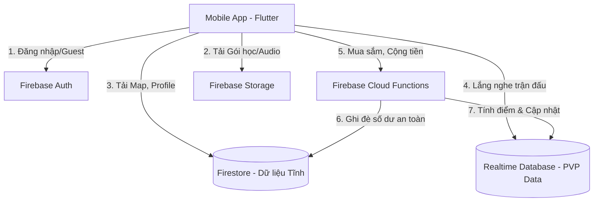
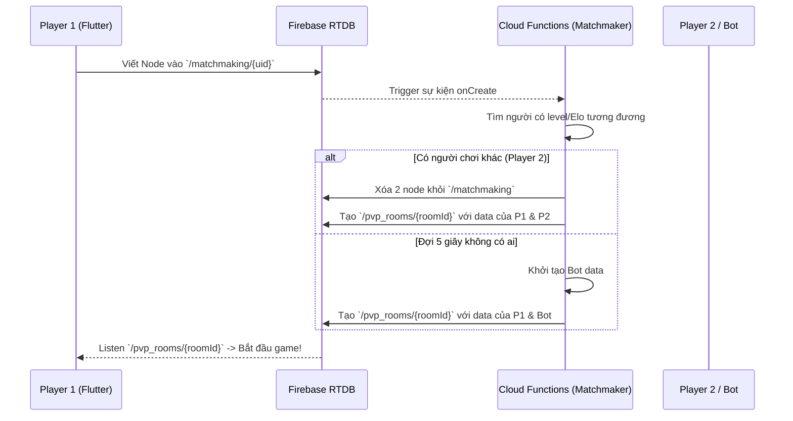

# Thiết kế Kiến trúc Hệ thống (Architecture Design)

## 1. System Context Diagram (Sơ đồ Tổng quan)
Sơ đồ dưới đây mô tả cách ứng dụng Flutter giao tiếp với hệ sinh thái Serverless của Firebase.



---

## 2. Sequence Diagrams (Luồng dữ liệu chi tiết)

### 2.1. Luồng Ghép cặp PVP (Matchmaking Flow)
Luồng này tối ưu để ghép người chơi thật siêu tốc hoặc tự động sinh Bot nếu không ai online.



---

## 3. Database Schema (Cấu trúc Cơ sở dữ liệu)

### 3.1. Firestore (Dữ liệu Tĩnh & Hồ sơ)
Quản lý các dữ liệu hiếm khi thay đổi theo thời gian thực (Giúp tiết kiệm chi phí Read/Write của Firestore).

**Collection `users`**
```json
{
  "uid": "user_123",
  "displayName": "MeoMeo",
  "email": "meo@gmail.com",
  "coinBalance": 2000,
  "eloRating": 1200,
  "currentLevel": 15,
  "inventory": {
    "item_50_50": 3,
    "item_freeze_time": 1
  },
  "createdAt": "Timestamp"
}
```

**Collection `levels`** (Dữ liệu bản đồ)
```json
{
  "id": "hsk1_level1",
  "name": "Xin chào",
  "requiredStars": 0,
  "rewardCoin": 50,
  "cards": ["card_1", "card_2", "card_3"]
}
```

### 3.2. Realtime Database (RTDB - Dữ liệu Động)
Sử dụng cho PVP vì độ trễ thấp (Low-latency) và tính phí theo băng thông mạng thay vì số lần Read/Write như Firestore.

**Path `/pvp_rooms/{roomId}`**
```json
{
  "status": "playing", // waiting, playing, finished
  "startTime": 1699990000000,
  "players": {
    "uid_A": {
      "score": 150,
      "status": "online", // Dùng Firebase Presence để bắt sự kiện Disconnect
      "currentAnswer": "A",
      "answerTime": 1699990012000
    },
    "uid_B": {
      "score": 80,
      "status": "online",
      "currentAnswer": "C",
      "answerTime": 1699990013000
    }
  },
  "currentQuestionIndex": 2,
  "questions": [
    {"id": "q1", "timeEnd": 1699990020000}, // Lưu mảng ID câu hỏi thay vì nội dung
    {"id": "q2", "timeEnd": 1699990035000}
  ]
}
```

---

## 4. Architectural Trade-offs (Sự đánh đổi)

1. **Firestore vs RTDB cho PVP:**
   - *Quyết định:* Dùng RTDB thay vì Firestore cho luồng PVP đang diễn ra.
   - *Lý do:* 1 trận đấu có thể phát sinh hàng chục lệnh update điểm số, trạng thái sẵn sàng, ngắt kết nối. Nếu dùng Firestore, tiền bill hàng tháng sẽ đội lên cực kỳ khủng khiếp vì tính phí theo số lượng Document Writes. RTDB tính phí theo Gigabyte Download, rẻ hơn 10-20 lần cho use-case có tần suất Ghi/Đọc liên tục trong thời gian ngắn.
2. **Game Engine (Flame) vs Flutter UI/Canvas:**
   - *Quyết định:* Không dùng Game Engine Flame mà tự dùng Canvas (`CustomPaint`) của Flutter để vẽ bản đồ.
   - *Lý do:* App vẫn là ứng dụng học tập, các màn hình như Flashcard, Profile, Shop vẫn cần form UI chuẩn (TextField, ScrollView). Dùng Game Engine sẽ làm app nặng, khó custom UI cơ bản. Khả năng vẽ của Flutter Canvas (`CustomPaint`) và tích hợp `Rive` đã quá đủ để tạo ra UI siêu mượt.
